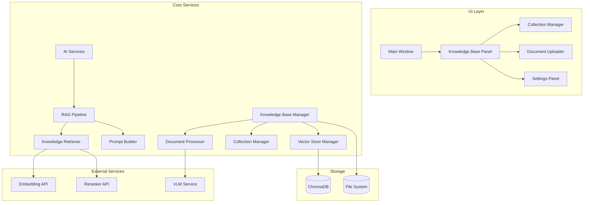
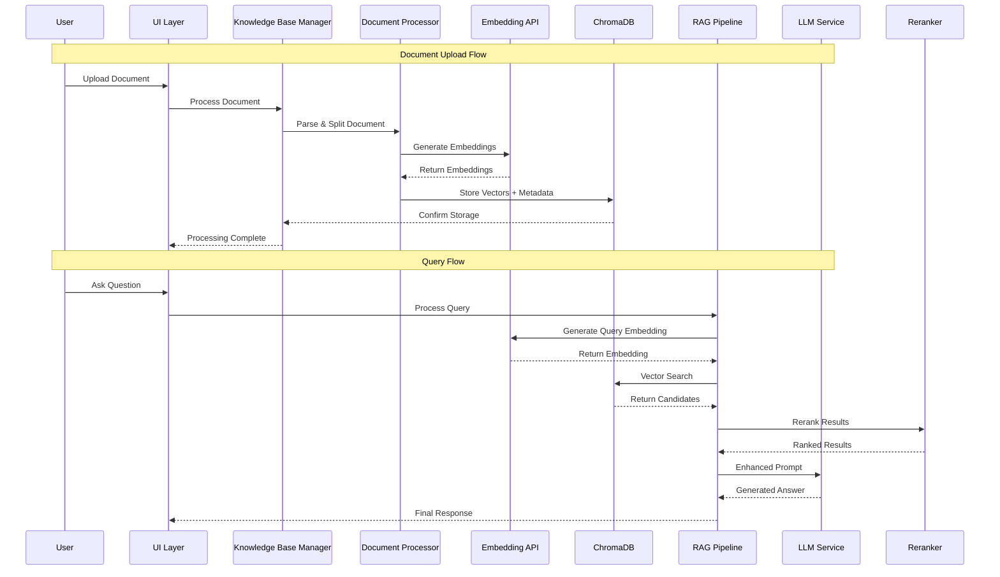

# Design Document

## Overview

The knowledge base feature introduces Retrieval-Augmented Generation (RAG) capabilities to QuizGazer, enabling users to create personalized knowledge bases from various document types. The system follows a two-phase approach: offline document processing and indexing, followed by online retrieval and generation during question-answering.

The design leverages external APIs for embedding and reranking to minimize local resource requirements while using ChromaDB for efficient local vector storage. The system supports mixed document types with specialized processing strategies for knowledge documents versus question banks.

## Architecture

### High-Level Architecture



### Data Flow Architecture



## Components and Interfaces

### 1. Knowledge Base Manager (`core/knowledge_base/manager.py`)

**Purpose**: Central orchestrator for all knowledge base operations.

**Key Methods**:
```python
class KnowledgeBaseManager:
    def create_collection(self, name: str, description: str = "") -> Collection
    def delete_collection(self, collection_id: str) -> bool
    def add_document_async(self, collection_id: str, file_path: str, doc_type: DocumentType) -> ProcessingTask
    def get_processing_status(self, task_id: str) -> ProcessingStatus
    def cancel_processing(self, task_id: str) -> bool
    def remove_document(self, collection_id: str, document_id: str) -> bool
    def list_collections(self) -> List[Collection]
    def get_collection_stats(self, collection_id: str) -> CollectionStats
    def export_collection(self, collection_id: str, format: str) -> str
    def import_collection(self, file_path: str, merge_strategy: str) -> Collection
    def list_processing_tasks(self) -> List[ProcessingTask]
```

**Dependencies**: Document Processor, Vector Store Manager, Configuration Manager

### 2. Document Processor (`core/knowledge_base/document_processor.py`)

**Purpose**: Handles document parsing, text extraction, and chunking strategies.

**Key Methods**:
```python
class DocumentProcessor:
    def process_document(self, file_path: str, doc_type: DocumentType) -> List[DocumentChunk]
    def process_knowledge_document(self, file_path: str) -> List[DocumentChunk]
    def process_question_bank(self, file_path: str) -> List[DocumentChunk]
    def extract_text_from_pdf(self, file_path: str) -> str
    def perform_ocr_extraction(self, pdf_pages: List[Image]) -> str
    def validate_csv_format(self, file_path: str) -> ValidationResult
```

**Chunking Strategies**:
- **Knowledge Documents**: Recursive character splitting with overlap (chunk_size=1000, overlap=200)
- **Question Banks**: Row-based processing, each Q&A pair as one chunk
- **OCR Documents**: Page-based processing with VLM integration

### 3. Knowledge Retriever (`core/knowledge_base/retriever.py`)

**Purpose**: Handles vector search, reranking, and knowledge fragment selection.

**Key Methods**:
```python
class KnowledgeRetriever:
    def retrieve_relevant_knowledge(self, query: str, collections: List[str], top_k: int = 10) -> List[KnowledgeFragment]
    def generate_query_embedding(self, query: str) -> List[float]
    def vector_search(self, embedding: List[float], collections: List[str], top_k: int) -> List[SearchResult]
    def rerank_results(self, query: str, candidates: List[SearchResult]) -> List[RankedResult]
    def format_knowledge_context(self, fragments: List[KnowledgeFragment]) -> str
```

**Search Strategy**:
1. Convert query to embedding using Embedding API
2. Perform similarity search in selected collections
3. Apply reranking using Reranker API
4. Return top-k most relevant fragments with metadata

### 4. RAG Pipeline (`core/knowledge_base/rag_pipeline.py`)

**Purpose**: Integrates retrieval with generation, manages the complete RAG workflow.

**Key Methods**:
```python
class RAGPipeline:
    def process_query_with_knowledge(self, query: str, selected_collections: List[str]) -> str
    def build_enhanced_prompt(self, original_query: str, knowledge_context: str) -> str
    def should_use_knowledge_base(self) -> bool
    def get_knowledge_base_status(self) -> KnowledgeBaseStatus
```

### 5. Background Task Manager (`core/knowledge_base/task_manager.py`)

**Purpose**: Manages asynchronous document processing tasks with progress tracking.

**Key Methods**:
```python
class BackgroundTaskManager:
    def submit_processing_task(self, collection_id: str, file_path: str, doc_type: DocumentType) -> ProcessingTask
    def get_task_status(self, task_id: str) -> ProcessingStatus
    def cancel_task(self, task_id: str) -> bool
    def list_active_tasks(self) -> List[ProcessingTask]
    def cleanup_completed_tasks(self, older_than_hours: int = 24) -> int
    def register_progress_callback(self, task_id: str, callback: Callable) -> None
```

### 6. Vector Store Manager (`core/knowledge_base/vector_store.py`)

**Purpose**: Manages ChromaDB operations and vector storage with support for both local and remote deployments.

**Key Methods**:
```python
class VectorStoreManager:
    def __init__(self, connection_config: ChromaDBConfig):
        # Supports both local and remote ChromaDB configurations
    
    def initialize_database(self) -> None
    def create_collection(self, name: str, metadata: dict) -> ChromaCollection
    def add_documents(self, collection_name: str, chunks: List[DocumentChunk], embeddings: List[List[float]]) -> None
    def search_similar(self, collection_names: List[str], query_embedding: List[float], top_k: int) -> List[SearchResult]
    def delete_collection(self, collection_name: str) -> bool
    def delete_documents(self, collection_name: str, document_ids: List[str]) -> bool
    def get_collection_stats(self, collection_name: str) -> dict
    def test_connection(self) -> ConnectionStatus
    def get_database_info(self) -> DatabaseInfo
```

## Data Models

### Core Data Structures

```python
@dataclass
class Collection:
    id: str
    name: str
    description: str
    created_at: datetime
    document_count: int
    total_chunks: int

@dataclass
class Document:
    id: str
    collection_id: str
    filename: str
    file_path: str
    document_type: DocumentType
    processed_at: datetime
    chunk_count: int
    file_size: int

@dataclass
class ProcessingTask:
    id: str
    document_id: str
    collection_id: str
    filename: str
    status: ProcessingStatus
    progress: float  # 0.0 to 1.0
    created_at: datetime
    started_at: Optional[datetime]
    completed_at: Optional[datetime]
    error_message: Optional[str]

@dataclass
class ProcessingStatus:
    PENDING = "pending"
    PROCESSING = "processing"
    COMPLETED = "completed"
    FAILED = "failed"
    CANCELLED = "cancelled"

@dataclass
class ChromaDBConfig:
    connection_type: str  # "local" or "remote"
    host: Optional[str] = None
    port: Optional[int] = None
    path: Optional[str] = None  # for local storage
    auth_credentials: Optional[dict] = None
    ssl_enabled: bool = False

@dataclass
class ConnectionStatus:
    is_connected: bool
    connection_type: str
    database_version: str
    error_message: Optional[str]

@dataclass
class DatabaseInfo:
    total_collections: int
    total_documents: int
    storage_size: str
    connection_info: ChromaDBConfig

@dataclass
class DocumentChunk:
    id: str
    document_id: str
    content: str
    metadata: dict
    chunk_index: int
    
@dataclass
class KnowledgeFragment:
    content: str
    source_document: str
    collection_name: str
    relevance_score: float
    metadata: dict

@dataclass
class SearchResult:
    chunk_id: str
    content: str
    distance: float
    metadata: dict

@dataclass
class RankedResult:
    content: str
    relevance_score: float
    source_info: dict

enum DocumentType:
    KNOWLEDGE_DOCUMENT = "knowledge"
    QUESTION_BANK = "question_bank"
```

### Database Schema (ChromaDB Collections)

Each user collection in ChromaDB will store:
- **Documents**: Vector embeddings of document chunks
- **Metadata**: Source file, document type, chunk position, collection info
- **IDs**: Unique identifiers for each chunk

Metadata structure:
```python
{
    "source_file": "document.pdf",
    "document_type": "knowledge",
    "collection_name": "exam_prep",
    "chunk_index": 0,
    "document_id": "doc_123",
    "created_at": "2024-01-01T00:00:00Z"
}
```

## Error Handling

### Error Categories and Strategies

1. **Document Processing Errors**
   - Invalid file formats → Clear validation messages with format requirements
   - OCR failures → Continue with available text, log failures
   - Large file timeouts → Background processing with progress tracking

2. **API Communication Errors**
   - Embedding API failures → Graceful degradation to standard LLM
   - Reranker API failures → Use vector similarity scores only
   - Network timeouts → Retry with exponential backoff

3. **Storage Errors**
   - ChromaDB connection issues → Display clear error messages, prevent operations
   - Disk space limitations → Check available space before processing
   - Corruption issues → Backup and recovery mechanisms

4. **User Input Errors**
   - Invalid CSV format → Detailed format validation with examples
   - Empty collections → Clear messaging about required content
   - Duplicate names → Automatic name suggestions

### Error Recovery Mechanisms

```python
class ErrorHandler:
    def handle_api_failure(self, api_type: str, error: Exception) -> FallbackStrategy
    def handle_processing_failure(self, document_id: str, error: Exception) -> RecoveryAction
    def handle_storage_failure(self, operation: str, error: Exception) -> RetryStrategy
    def log_error(self, context: str, error: Exception, user_message: str) -> None
```

## Testing Strategy

### Unit Testing

1. **Document Processor Tests**
   - Test each document type processing
   - Validate chunking strategies
   - Test OCR integration with mock VLM responses
   - Test CSV format validation

2. **Vector Store Tests**
   - Test ChromaDB operations
   - Test collection management
   - Test search functionality with mock embeddings

3. **Retriever Tests**
   - Test embedding generation with mock API
   - Test reranking with mock API responses
   - Test knowledge fragment formatting

### Integration Testing

1. **End-to-End RAG Pipeline**
   - Upload document → Process → Query → Retrieve → Generate
   - Test with different document types
   - Test with multiple collections

2. **API Integration Tests**
   - Test Embedding API integration
   - Test Reranker API integration
   - Test error handling for API failures

3. **UI Integration Tests**
   - Test knowledge base panel functionality
   - Test collection management UI
   - Test settings configuration

### Performance Testing

1. **Large Document Processing**
   - Test with documents >100MB
   - Measure processing time and memory usage
   - Test background processing capabilities

2. **Vector Search Performance**
   - Test search speed with large collections (>10k chunks)
   - Test concurrent query handling
   - Measure embedding generation latency

3. **Storage Efficiency**
   - Test ChromaDB storage requirements
   - Test query performance with growing data

### User Acceptance Testing

1. **Document Upload Scenarios**
   - Upload various PDF types (text, image, mixed)
   - Upload different CSV formats
   - Upload Markdown files with various structures

2. **Query Accuracy Testing**
   - Compare answers with/without knowledge base
   - Test relevance of retrieved knowledge
   - Test citation accuracy

3. **Collection Management**
   - Create, rename, delete collections
   - Import/export functionality
   - Multi-collection queries

## Configuration and Deployment

### Configuration Updates

The system requires new configuration sections in `config.ini`:

```ini
[knowledge_base]
enabled = true
storage_path = ./data/knowledge_base
max_file_size_mb = 100
chunk_size = 1000
chunk_overlap = 200
max_collections = 50
background_processing = true
max_concurrent_tasks = 3

[chromadb]
connection_type = local  # local or remote
host = localhost  # for remote connections
port = 8000  # for remote connections
path = ./data/chromadb  # for local storage
auth_token =  # for remote authentication
ssl_enabled = false

[embedding_api]
endpoint = https://api.example.com/v1/embeddings
api_key = your_api_key
model = text-embedding-ada-002
timeout = 30

[reranker_api]
endpoint = https://api.example.com/v1/rerank
api_key = your_api_key
model = rerank-multilingual-v2.0
timeout = 30
```

### Deployment Considerations

1. **Dependencies**
   - ChromaDB installation and initialization
   - LangChain integration
   - PDF processing libraries (PyPDF2, pdfplumber)
   - CSV processing capabilities

2. **Storage Requirements**
   - Local storage for ChromaDB
   - Temporary storage for document processing
   - Backup storage for collections

3. **Performance Optimization**
   - Background task processing
   - Caching for frequently accessed embeddings
   - Connection pooling for API calls

This design provides a robust, scalable foundation for the knowledge base feature while maintaining the modular architecture of QuizGazer and ensuring seamless integration with existing functionality.